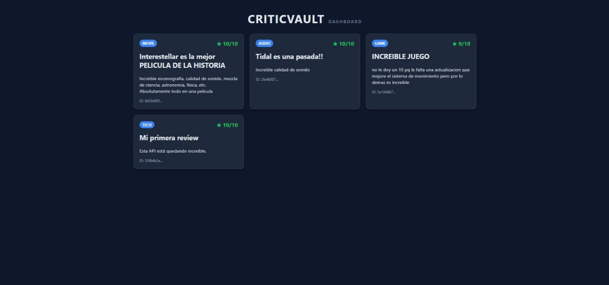

# 🛡️ CriticVault - API RESTful con Django

Plataforma de gestión de reseñas y críticas (Tech, Gaming, Cine, Audio) construida con una arquitectura escalable y moderna. Este proyecto demuestra la implementación de una API RESTful completa consumida por un cliente frontend asíncrono.



## 🚀 Tecnologías Clave

* **Backend:** Python 3, Django 5.
* **API:** Django Rest Framework (DRF).
* **Base de Datos:** SQLite (Dev) / PostgreSQL (Ready).
* **Frontend:** HTML5, CSS3, Vanilla JS (Fetch API).
* **Seguridad:** UUIDs para identificadores opacos (IDOR protection) y CORS configurado.

## ⚡ Características Técnicas

* **Arquitectura Limpia:** Separación de preocupaciones (Settings modular, Apps desacopladas).
* **CRUD Completo:** Gestión total de reseñas a través de endpoints REST.
* **Validaciones de Negocio:** Lógica personalizada en Serializers (ej. rangos de puntuación).
* **API Versioning:** Endpoints estructurados bajo `/api/v1/` para mantenibilidad futura.
* **Admin Dashboard:** Panel de administración personalizado con filtros y búsqueda.

## 🔧 Instalación y Uso

1.  Clonar el repositorio:
    ```bash
    git clone [https://github.com/AxelvillaInacap/CriticVault.git](https://github.com/AxelvillaInacap/CriticVault.git)
    cd CriticVault
    ```

2.  Crear entorno virtual e instalar dependencias:
    ```bash
    python -m venv venv
    venv\Scripts\activate
    pip install -r requirements.txt
    ```

3.  Ejecutar migraciones y servidor:
    ```bash
    python manage.py migrate
    python manage.py runserver
    ```

---
Hecho con 💙 por Axel Villa